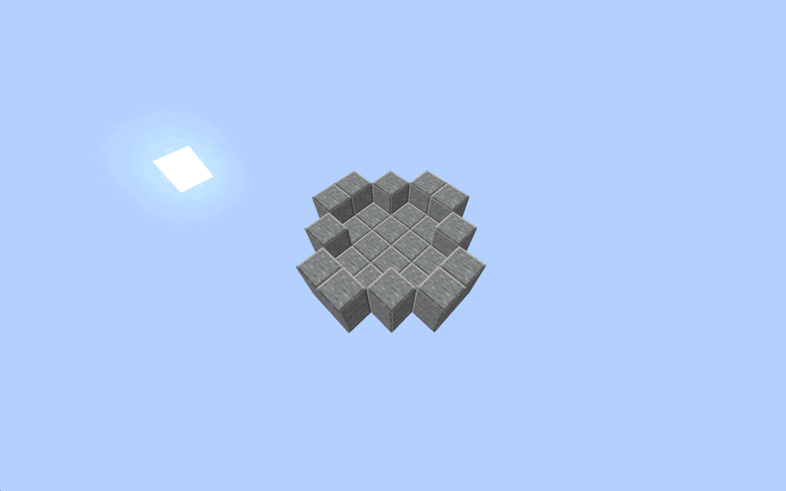
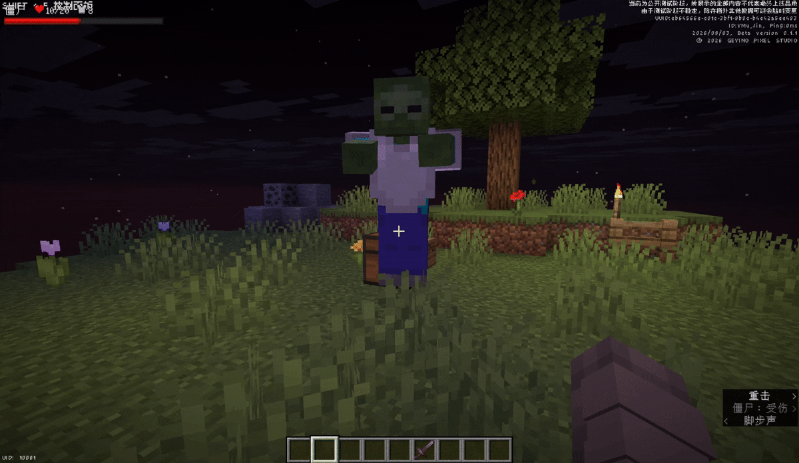
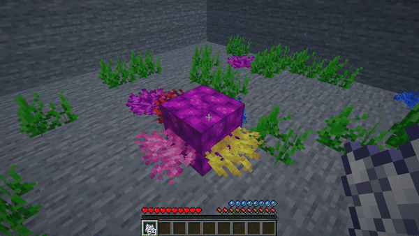
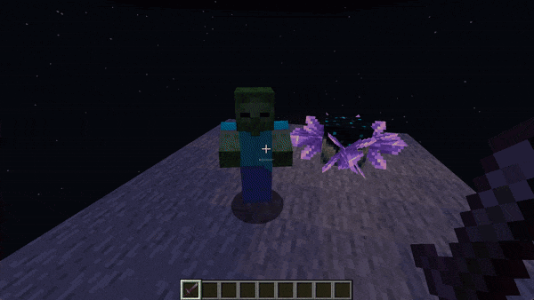
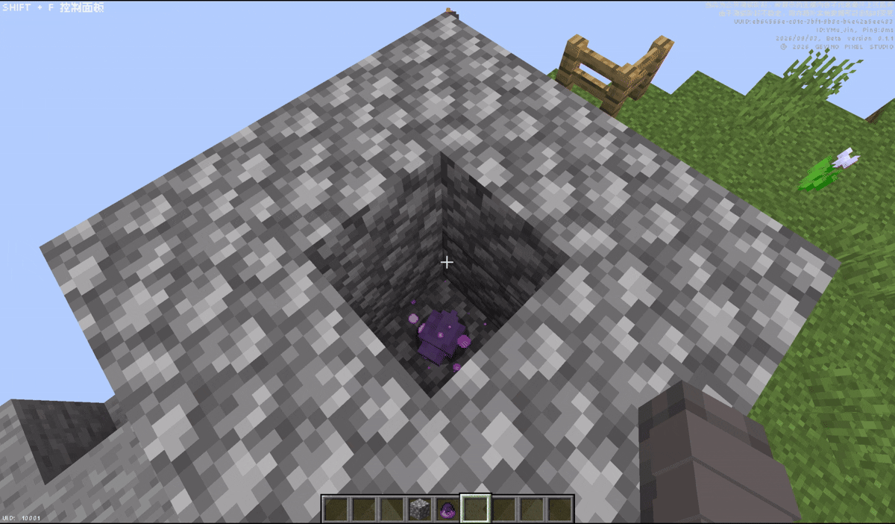
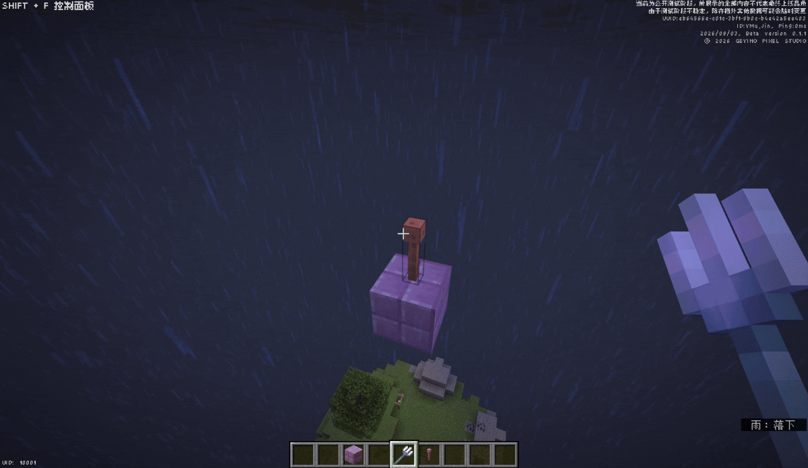
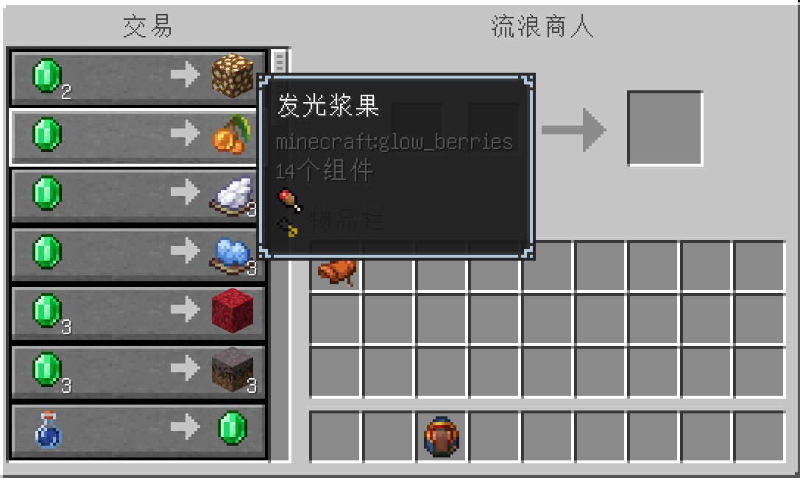
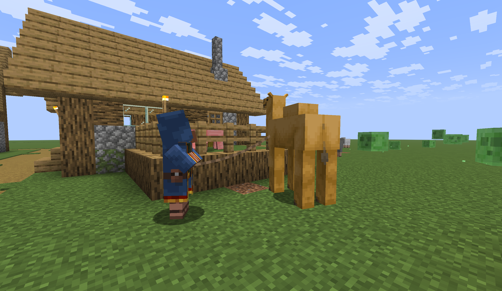
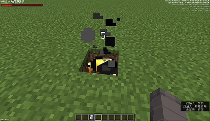

# 拓展机制

:::tip
此页面正在完善中，部分概率和数据可能随版本调整。
:::
:::info
本页展示服务器中所有自定义或修改过的游戏机制
:::

## 紫晶洞生成
可以通过使用浮冰和熔岩来生成紫晶洞。

将一个 2×2×2 的浮冰方块完全用熔岩包围（顶部放置 4 个熔岩源方块，其余可为流动的熔岩），即可开始转化过程。

### 生成步骤
1. 放置一个 2×2×2 的浮冰方块结构
2. 在浮冰周围围上熔岩（顶部必须放置 4 个熔岩源方块，侧面可用流动熔岩）
3. 等待转化完成，浮冰将变为紫晶洞结构

### 演示

---

## 怪物胸甲破碎
:::tip
怪物必须身穿胸甲
:::
击打身穿胸甲的怪物概率会破坏胸甲，并掉落一种基础材料。

| 掉落材料 |
|------|
 下界合金碎片
 铁粒
 金粒
 铜粒

### 演示

---

## 盔甲纹饰赠礼
盔甲匠在“村庄英雄”效果下有概率随机赠送盔甲纹饰锻造模板，每次 1 件，类型由玩家所处位置或群系决定。

### 赠礼条件

| 类型 | 条件 | 纹饰 |
|----------|----------|------------|
| 群系 | 沙漠 | 沙丘 |
| 群系 | 丛林 | 荒野 |
| 群系 | 所有海洋群系 | 海岸 |
| 群系 | 针叶林 / 积雪针叶林 / 原始针叶林 / 原始桦木森林 / 丛林 | 雇主、牧民、塑造、向导 |
| 维度 | 主世界 | 眼眸 |
---

## 洞穴蜘蛛生成
在光照等级为 0 的 3×3 蜘蛛网区域内，生成的蜘蛛会变为洞穴蜘蛛。

---

## 蜘蛛结网
蜘蛛在天花板边缘活动时，会随时间在其路径上生成蜘蛛网。

---

## 珊瑚扇转化为珊瑚块
对附着有珊瑚扇的珊瑚块使用骨粉，可将其转化为珊瑚块。

### 演示

---

## 钓鱼获取战利品
### 枯死的灌木
- 在沙漠或恶地生物群系钓鱼时，枯死灌木可作为垃圾战利品获得。

### 可可豆
- 在丛林生物群系钓鱼时，可可豆可作为垃圾战利品获得。

---

## 紫晶簇转换为回响碎片
若紫晶簇放置在幽匿催发体上方，玩家在其附近击杀任意生物后，该紫晶簇会消失并掉落1个回响碎片。

### 演示

---

## 圆石转化为末地石
末影螨可钻入圆石并将其转化为末地石。
:::danger
此机制可能会对建筑物造成破坏，请在安全的地方使用。
:::
**转化步骤：**
1. 获取末影螨（可通过投掷末影珍珠概率生成）
2. 在圆石附近释放末影螨
3. 末影螨会主动钻入圆石方块
4. 圆石将被转化为末地石

---

## 末地石转化为紫颂花
:::tip
被转化的末地石正下方必须存在另一块末地石，方可触发该转化
:::
末影螨钻入末地石后，若该末地石正下方存在另一块末地石，则前者会转化为紫颂花。

### 演示

---

## 远古守卫者掉落海洋之心
:::tip
被附近闪电击中的守卫者会转化为远古守卫者
:::
远古守卫者被击败后会掉落海洋之心。

---

## 沙子与红沙转化
在火焰中死亡的尸壳会将其下方的泥土转化为沙子，将砂土转化为红沙。

---

## 闪电转化
### 生成蠹虫
- 被附近闪电击中的石头、圆石和深板岩会滋生蠹虫
### 生成凋灵骷髅
- 被附潜近闪电击中的骷髅会转化为凋灵骷髅
### 生成潜影贝
:::tip
不可用避雷针的变体
:::
- 被闪电击中的紫珀块会转化为潜影贝
#### 演示

### 生成远古守卫者
- 被附近闪电击中的守卫者会转化为远古守卫者

---

## 大滴水叶剪切
使用剪刀挖掘大滴水叶的顶部时，会掉落小滴水叶。

---

## 嗅探兽蛋孵化
溺尸生成时手持嗅探兽蛋的溺尸，在踩踏海龟蛋后会放置嗅探兽蛋。

---

## 可疑方块转化
嗅探兽站在沙子或沙砾上打喷嚏时，会将其转化为可疑的沙子或可疑的沙砾。

---

## 狐狸与甜浆果
自然生成的狐狸有概率携带甜浆果。

---

## 额外游商交易
流浪商人新增以下交易物品：

| 物品 |
|------|
| Otherside 唱片 |
| 遗迹碎片 |
| 唱片碎片 5 |
| 大型花（Tall Flower） |
| 发光浆果 |

### 演示

---

## 骆驼商人
部分流浪商人会牵着骆驼代替原有的行商羊驼。

### 演示

---

## 试炼密室陶片赠礼
试炼密室中的石匠提供该结构专属的陶器碎片。

---

## 铁砧转化
### 沙子
铁砧坠落到沙砾上时，着陆点的沙砾会转化为沙子。

### 砂岩
铁砧坠落到沙子上时，着陆点的沙子会转化为砂岩。

### 深板岩`v0.2.2`
铁砧坠落到凝灰岩上时，着陆点的凝灰岩会转化深板岩。

---

## 猫赠送附魔金苹果 `v0.2.2`
驯服的猫在睡觉时会赠送附魔金苹果。

---

## 末影人掉落末地传送门`v0.2.2`
被监守者的音爆击杀的末影人可以掉落末地传送门框架。

---

## 末影人持有幽匿尖啸体`v0.2.2`
:::tip
需要末影人放置的幽匿尖啸体才能生成监守者。
:::
末影人在深板岩瓦上生成，概率手持幽匿尖啸体，放置后可生成监守者

---

## 金块以物易物`v0.2.2`
猪灵会接受金块，以交换下列物品。
| 物品 |
|------|
| 猪灵唱片 | 
| 马铠 |
| 镶金黑石 |
| 下界疣 |
| 旗帜图案 |
---

## 猪灵蛮兵将穿戴下界合金盔甲`v0.2.2`
猪灵蛮兵可以在堡垒遗迹中生成，并概率穿戴下界合金盔甲。

---

## 猪灵将持有下界合金升级模板`v0.2.2`
猪灵可以在堡垒遗迹中生成，并概率持有下界合金升级模板。

---

## 岩浆怪将矿石转化为其他方块`v0.2.2`
岩浆怪会吞噬石头、深板岩、下界岩，将其转化为矿石或不同石类。

---

## 沉重核心`v0.2.2`
下落的铁砧被旋风人射中有概率转化为沉重核心。

---

## 旋风人转化`v0.2.2`
被细雪杀死的烈焰人会转变为旋风人

### 演示

---

## 岩浆块冷却为凝灰岩`v0.2.2`
被风弹击中的岩浆块会转化为凝灰岩。

---

## 方解石来自死珊瑚块`v0.2.2`
将死珊瑚块放在熔岩旁边可转化为方解石。周围的熔岩越多，转化越快（最多4块熔岩，至少有一块必须是源方块，其余可以是流动熔岩）

---

## 末影龙掉落损坏的鞘翅`v0.2.4`
击杀末影龙概率掉落损坏的鞘翅

## 穿着金质纹饰的装备时不会被猪灵攻击`v0.2.7`
穿着金质纹饰的装备时不会被猪灵攻击

---